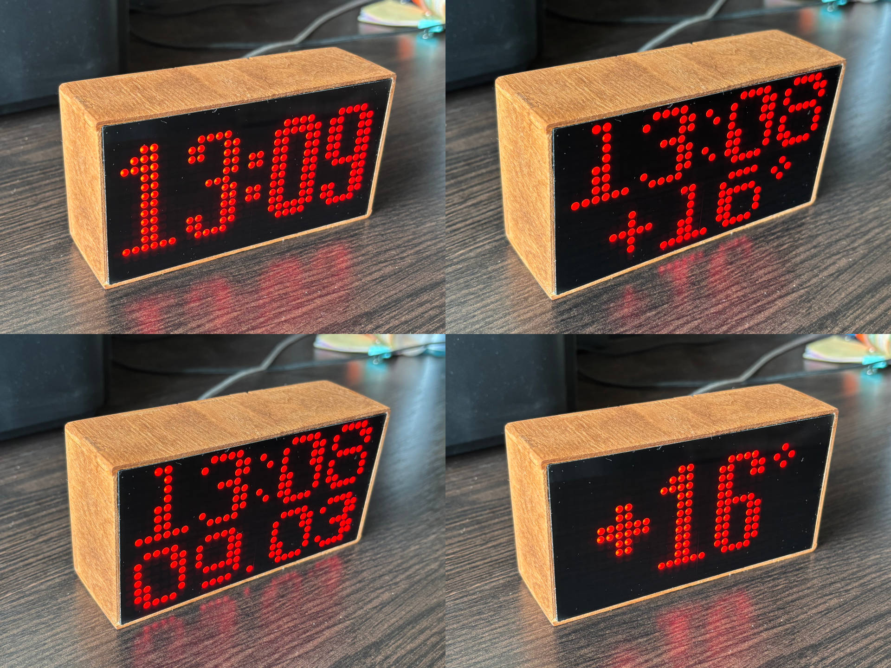
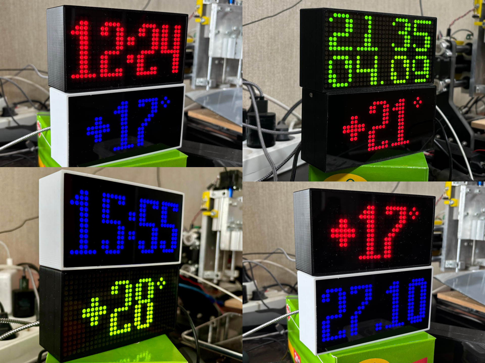
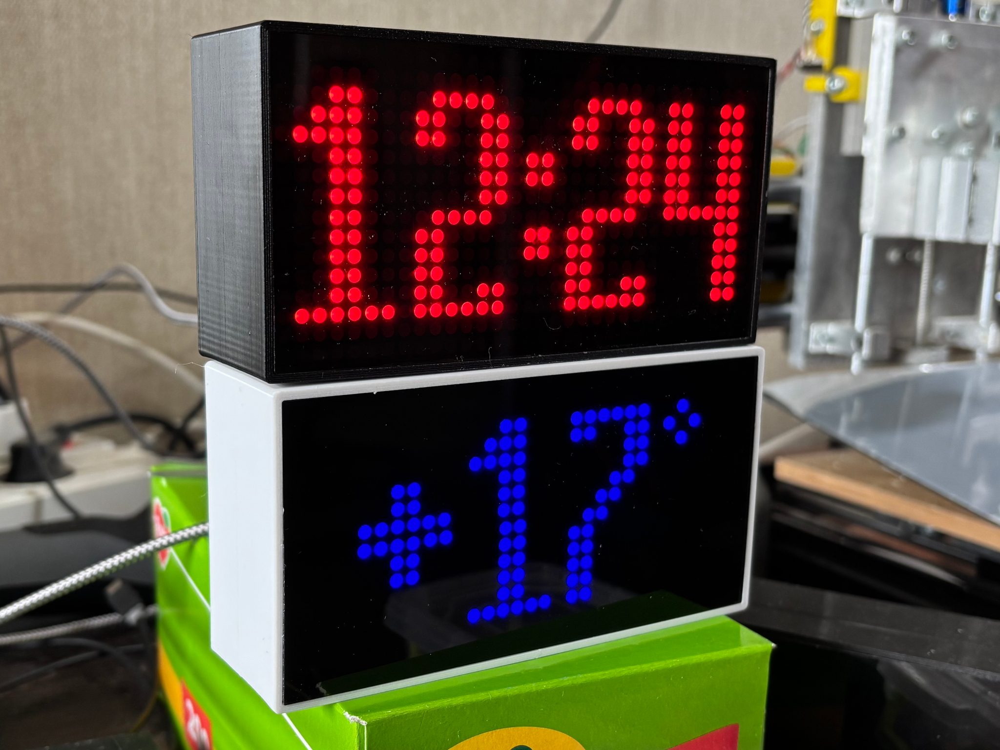
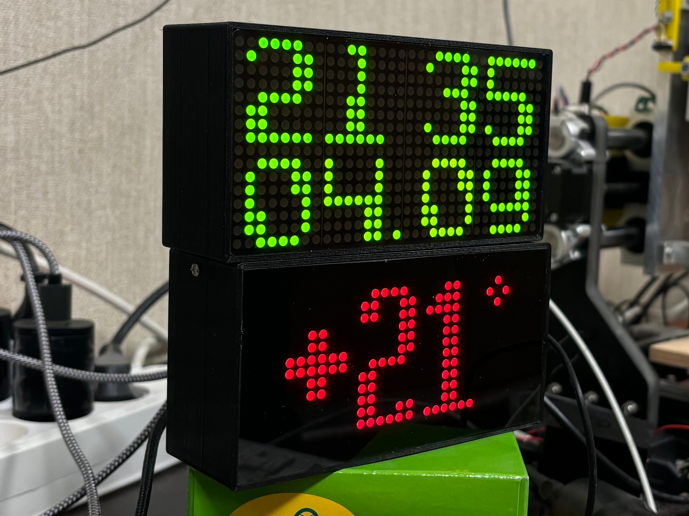
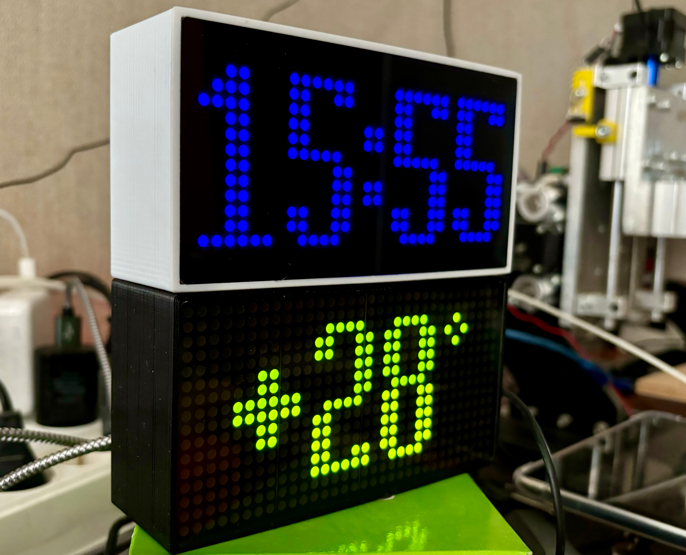
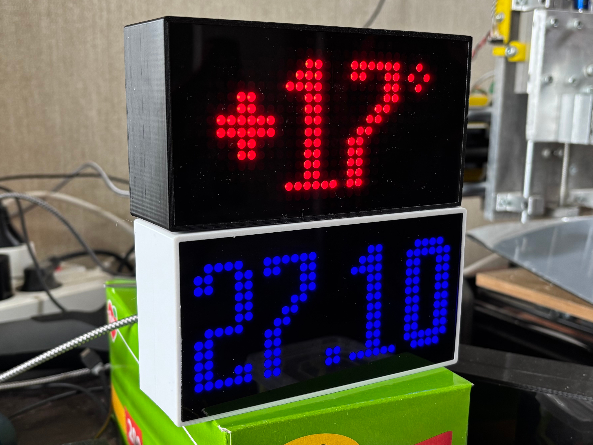
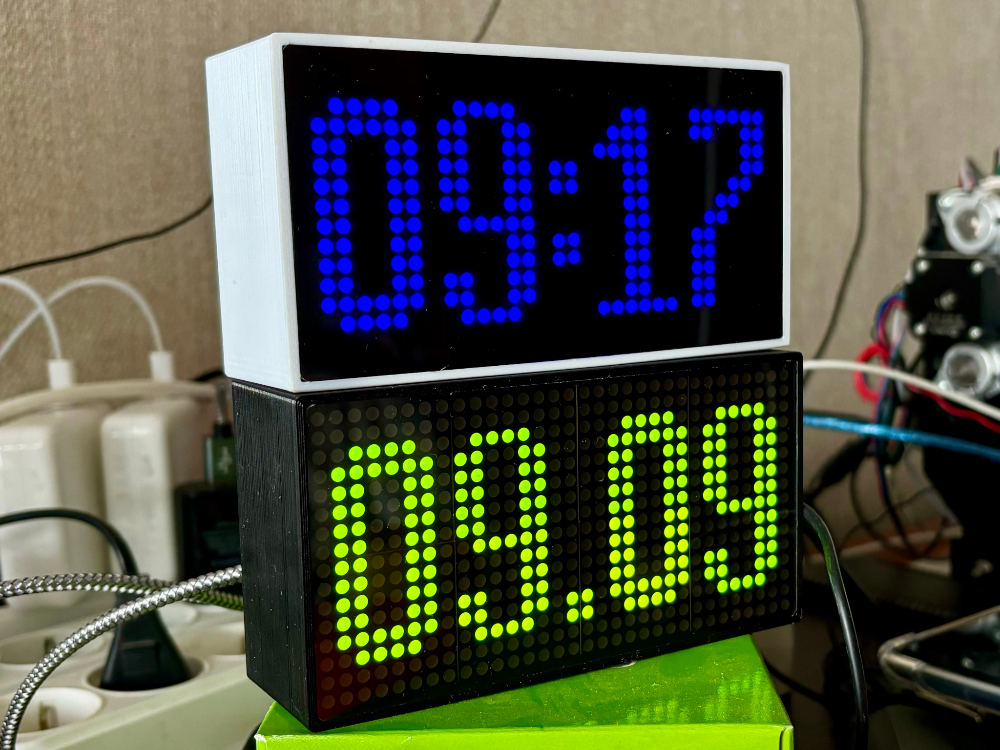

# Cronus


**Cronus** is a minimalistic digital clock built on the top of ESP32 MCU with the following features in mind.

- Display the current time, date, and weather conditions.
- Simple, bright display with brightness auto-adjustment depending on the ambient light level.
- Simple: No buttons or any other controls.
- Automatic Over-the-Air firmware upgrades.
- No bloody Arduino.


<details>
<summary>See more</summary>







</details>

## How to make it

See the [Wiki](https://github.com/ashep/cronus/wiki).

## Contributing

Clone the repo:

```shell
git clone --recurse-submodules https://github.com/ashep/cronus.git
```

Or update an already cloned one to the latest version:

```shell
git pull
git submodule update --recursive --remote
```

## Changelog

### 0.0.1 (2025-06-21)

First stable release.

## Authors

- [Oleksandr Shepetko](https://shepetko.com).
